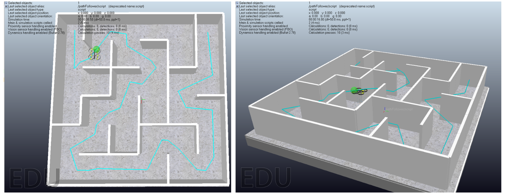
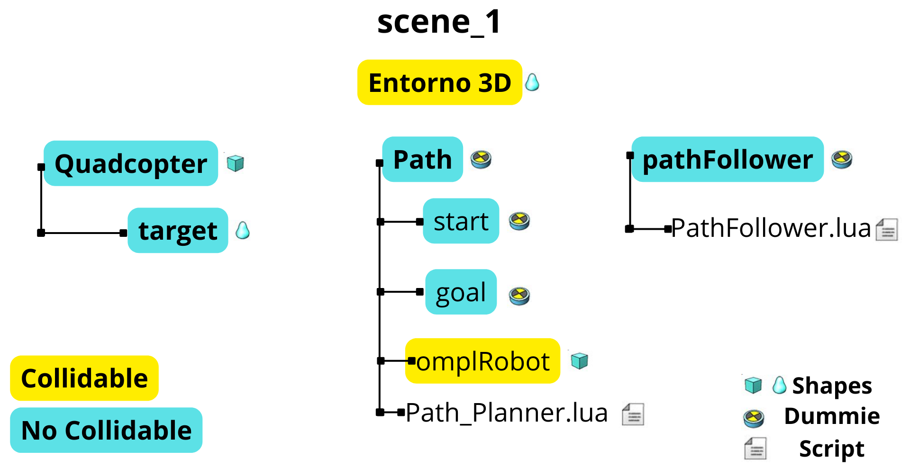

# Quadcopter + OMPL (simOMPL) in CoppeliaSim

## Objective
Implement a complete workflow in **CoppeliaSim** where a **Quadcopter** (built-in CoppeliaSim model) follows a trajectory generated with the **OMPL API (simOMPL)** from a start point to a goal point while **avoiding obstacles** in the environment.

**Technical note:** the trajectory is computed using a *collision proxy* (a simple `shape`) that represents the drone volume. The Quadcopter model is **not modified** to keep the setup simple. Motion is executed by moving the drone `target`, while the Quadcopter internal controller handles the dynamics.

---

## Method overview

---

## 1) Software
- **CoppeliaSim (Educational)**, version: **[fill in here]**
- Planning is performed using the **simOMPL** plugin available in CoppeliaSim.

---

## 2) Quadcopter
1. Add the built-in **Quadcopter** model to the scene from:
   `Models → Robots → Mobile → Quadcopter`

2. Ensure that the drone shapes (body and propellers) and the `target` have the following property **disabled**:
   - `Object properties → Special properties → Collidable`

   This prevents unnecessary collision checks between the proxy and the drone (and avoids planning issues when using `sim.handle_all`).

3. The Quadcopter includes an internal controller script. When the simulation runs:
   - The drone follows a child object named `target`.
   - If `target` is moved, the drone uses physics/dynamics to move toward it.

**Expected behavior:** if the `target` follows the planned trajectory, the drone will follow it in a stable way.

---

## 3) `Path` module (OMPL planning)
Create a container `dummy` (recommended name: `Path`) and place it at the **scene root** (i.e., **not** under the Quadcopter). Then add the following children:

### 3.1 `start` (dummy)
- Defines the **start position** of the trajectory.
- Recommended: place it at a safe height `z` (above the proxy radius) to avoid invalid start states due to floor collision.

### 3.2 `goal` (dummy)
- Defines the **goal position** (destination).
- Must also be placed at a valid height and not intersect obstacles.

### 3.3 `omplRobot` (primitive shape)
- The **collision proxy**, typically a **sphere** sized approximately like the drone.
- OMPL uses this proxy to check collisions during planning (instead of the real drone geometry).

**Recommended `omplRobot` configuration:**
- `Object properties → Special properties`:
  - ✅ `Collidable` (enabled)
- `Dynamic properties dialog`:
  - ⛔ `Body is dynamic` (disabled)
  - ⛔ `Body is respondable` (disabled)

This enables collision detection without physics interaction (no falling due to gravity, no physical pushing/impact).

### 3.4 `Path_Planner.lua` (script)
This script:
1. Creates an OMPL task (`simOMPL.createTask`)
2. Defines a state space (e.g., `pose3d`) and its bounds
3. Selects a planning algorithm (e.g., `RRTConnect`)
4. Sets collision pairs using `omplRobot`
5. Computes the trajectory and draws it in **cyan**
6. Stores the computed path so the follower can execute it

**Note:** the script searches objects by name/path (e.g., `/Path/start`), so object names must match exactly.

---

## 4) `pathFollower` (trajectory execution)
Create a `dummy` named `pathFollower` that contains a script:

### `pathFollower.lua`
- Runs after the planner generates the path
- Reads the waypoint list from the stored path
- Moves the drone `target` along the path using time interpolation (continuous motion)
- The Quadcopter controller then handles the dynamics to follow the moving target

---

## 5) How it works (full pipeline)
1. The environment is prepared with obstacles (`Collidable` enabled on obstacles).
2. `start` and `goal` are placed (with valid `z` height).
3. `Path_Planner.lua` runs OMPL, avoids obstacles using `omplRobot`, and draws a cyan path.
4. `pathFollower.lua` moves the drone `target` along the path.
5. The Quadcopter follows the `target` and completes the navigation.

---

## 6) Included scenario
This repository includes:
- A CoppeliaSim scene with a maze-like environment
- A maze STL file used as part of the obstacle setup

**Run instructions:**
1. Open the `.ttt` scene in CoppeliaSim.
2. Start the simulation.
3. Wait for the planner to compute a solution (time depends on algorithm and environment complexity).

---

## 7) Trying different trajectories (planners)
In `Path_Planner.lua`, the planning algorithm can be changed (depending on what your CoppeliaSim/simOMPL version supports). For example:
- `RRTConnect` for fast feasible solutions
- `RRT*` / `PRM*` (if available) for more “optimal” solutions (may take longer)

Refer to the CoppeliaSim / simOMPL documentation for the list of available planners in your version.
